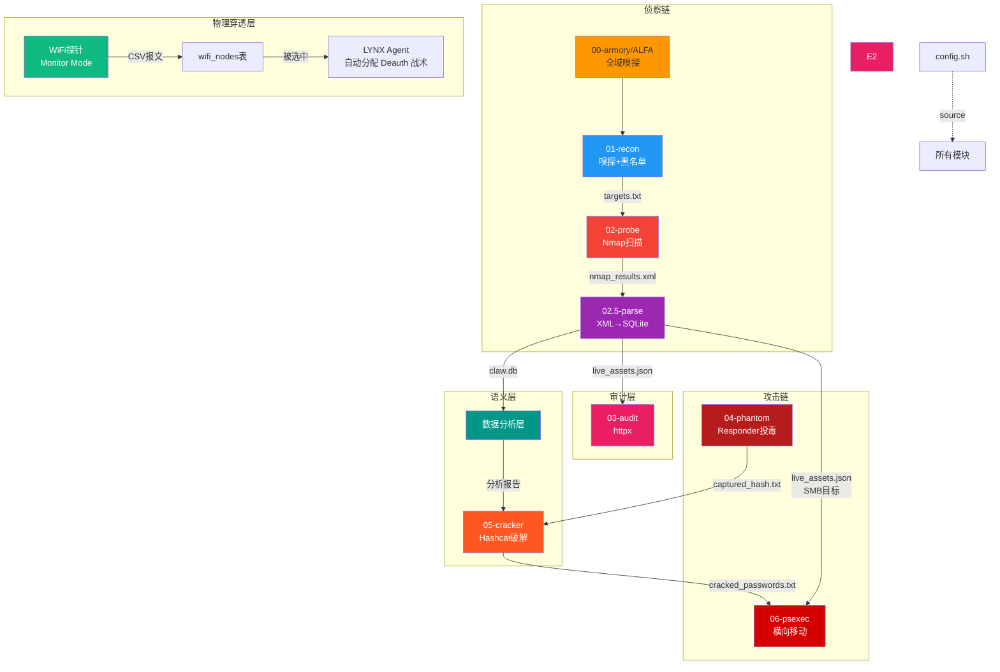

# CatTeam 架构设计文档 V9.3 / Electro-Phantom

## 1. 平台定位

### 1.1 核心哲学：做减法

> **CLAW = 态势感知指挥中枢（只看、只分析，不打）。**
> **Kali = 武器库。攻击执行交给 Kali 原生工具 + 人工操作。**

```
CLAW V7-V8: 工具集 -> 框架 -> 作战平台
CLAW V9.2:  AI Copilot + 物理层雷达
CLAW V9.3:  做减法 -- 回归指挥中枢定位，砍掉武器自动化

三角分工:
  Kali (武器库)     = aircrack-ng, hashcat, nmap, Wireshark...
  CLAW (指挥中枢)   = 雷达大屏 + 资产数据库 + AI 分析 + 战报
  Gemini CLI (参谋) = Kali 终端内 AI 辅助分析
```

### 1.2 竞品对标

| 系统 | 类型 | 界面 | 开源 | 核心能力 |
|---|---|---|---|---|
| **Kali Linux** | 工具集 | CLI | ✅ | 600+ 工具预装 |
| **Metasploit** | 框架 | CLI + Armitage | ✅ | exploit 库 + payload |

## 2. 核心架构拓扑图

```
┌──────────────────────────────────────────┐
│    Web Dashboard (React + Vite)           │ <- V9.3 态势感知大屏
│  C4ISR HUD · 战区沙盒 · 多选标靶         │
├──────────────────────────────────────────┤
│    API 层 (FastAPI)                       │ 
│  /env/switch · /agent/chat · /sensors/*   │
├──────────────────────────────────────────┤
│    ALFA 物理侦察管线 (V9.3)               │
│  Monitor / 雷达感知 / RSSI Sparkline      │
│  AP Ghosting / 探针健康检测               │
├──────────────────────────────────────────┤
│    MCP 层 (Model Context Protocol)       │ 
│  mcp_armory_server.py: 工具 -> MCP Tool   │
│  MCP 工具调用监控台 (实时透明化)           │
├──────────────────────────────────────────┤
│    LYNX Copilot (Gemini 3.1 Pro)         │ <- A3.0 
│  ReAct Loop + CodeExecution 云端沙箱     │
│  本地 SQLite 感知 + Google Search         │
│  Pro/Flash 自动降级保障                   │
├──────────────────────────────────────────┤
│    合规层 (scope.txt ROE)                │
│  白名单 CIDR 校验 + 黑名单过滤            │
├──────────────────────────────────────────┤
│    模块层 (00-17)                        │
│  侦察链: 00->01->02->02.5               │
│  审计层: 03-audit / 03-web / Nuclei      │
│  攻击链: 04->05->06 (Kali 人工执行)      │
│  情报层: 07-report / 08-diff             │
├──────────────────────────────────────────┤
│    数据层                                │
│  SQLite: claw.db (AI Text-to-SQL)        │
│  WiFi:   wifi_nodes + wifi_rssi_history  │
│  JSON:   live_assets.json (jq 兼容)      │
├──────────────────────────────────────────┤
│    基础设施层                             │
│  Mac 宿主机 <-- SSH --> Kali VM          │
│  (Docker 已于 V9.3 正式退役)              │
└──────────────────────────────────────────┘
```
└──────────────────────────────────────────┘
```

---

## 4. 全模块职责矩阵

### 侦察链 (Recon Chain)

| 模块 | 环境 | 输入 | 输出 | 关键特性 |
|---|---|---|---|---|
| `00-armory` | Mac | en0 | 新 IP | DHCP 超时保护 (10s) |
| `01-recon` | Mac (sudo) | 网络流量 | `targets.txt` | 正则提取, 黑名单过滤, trap 清理 |
| `02-probe` | Docker | `targets.txt` | `nmap_results.*` | PROFILE 端口切换, 日志保留 |
| `02.5-parse` | Mac (Python) | `nmap_results.xml` | `live_assets.json` + `claw.db` | 双写: SQLite + JSON |
| `ALFA 射频探针` | Mac (Monitor) | 物理环境电磁波 | `wifi_nodes` 表 | BSSID 实时感知与脱机解爆战术池 |

### 审计层 (Audit Layer)

| 模块 | 环境 | 输入 | 输出 | 关键特性 |
|---|---|---|---|---|
| `03-audit` | Docker | `live_assets.json` | `httpx_results.txt` | httpx 应用层指纹 |
| `03-audit-web` | Mac (Python) | `live_assets.json` | `web_fingerprints.txt` | 纯 Python, 10 线程并发 |
| `03-exploit-76` | Mac (Python) | 硬编码 IP | 终端输出 | VNC Banner + SMB 匿名探测 |

### 攻击链 (Attack Chain)

| 模块 | 环境 | 输入 | 输出 | 关键特性 |
|---|---|---|---|---|
| `04-phantom` | **Mac 原生** | en0 网卡 | `captured_hash.txt` | 原生 Responder, 实时 Hash 清洗管线 |
| `05-cracker` | **Mac 原生** | `captured_hash.txt` | `cracked_passwords.txt` | 宿主机 Hashcat (GPU/Metal) |
| `06-psexec` | Docker | `live_assets.json` + 凭据 | `lateral_results.txt` | Impacket smbexec, 凭据自动加载 |

### 情报层 (Intelligence Layer)

| 模块 | 环境 | 输入 | 输出 | 关键特性 |
|---|---|---|---|---|
| `07-report` | Mac (Python) | 所有 Loot 文件 | `CatTeam_Report.md` | 端口热力榜, 凭据脱敏, 风险评级 |
| `08-diff` | Mac (Python) | `claw.db` (fallback JSON) | `asset_diff.json` | SQL EXCEPT 差异引擎 |

### AI 副官 (v5.0 新增)

| 模块 | 环境 | 输入 | 输出 | 关键特性 |
|---|---|---|---|---|
| `db_engine` | Mac (Python) | — | `claw.db` | 四张表 (带有 `env` 字段支持多靶场隔离) |
| `16-ai-analyze` | Mac (Python) | `claw.db` + `web_fingerprints.txt` (最高频同步) | 终端输出 | Gemini Flash 战术分析, 解决时序差异 |
| `17-ask-lynx` | Mac (Python) | `claw.db` + `web_fingerprints.txt` | 终端对话 | 多轮对话, 滑动窗口 10 轮 |

### 工具箱 (v5.0.1 新增)

| 模块 | 环境 | 输入 | 输出 | 关键特性 |
|---|---|---|---|---|
| `11-webhook` | Mac (Python) | `08-diff` 结果 | `alerts/` 目录 | 自动 Diff + AI 分析 + macOS 通知 |
| `scripts/firmware-autopsy` | Mac (Python) | `.bin` 固件文件 | 终端输出 | 零依赖 binwalk 替代, CVE 签名猎杀 |
| `scripts/examples/20-*` | Mac (Python) | IP | 终端输出 | TP-Link CVE PoC (实战参考) |
| `scripts/examples/22-*` | Mac (Python) | IP | 终端输出 | HP 多协议探测 (实战参考) |

### 战术升级 (v5.0.1-B 新增)

| 模块 | 环境 | 输入 | 输出 | 关键特性 |
|---|---|---|---|---|
| `18-ai-bloodhound` | Mac (Python) | BloodHound JSON/ZIP | 终端输出 | Gemini 图论推理 AD 域提权路径 |
| `23-hp-proxy-unlocker` | Mac (Python) | IP + 凭据字典 | 终端输出 | 4 阶段代理解锁: 端口→状态→爆破→隧道 |
| `make toolbox` | Docker/Mac | 交互选择 | 各工具输出 | Nikto/Hydra/Sqlmap/binwalk/固件解剖刀 |

### 🧠 LYNX Copilot 智能体 (V9.2 架构)

| 模块 | 环境 | 输入 | 输出 | 关键特性 |
|---|---|---|---|---|
| `agent_mcp.py` | Mac (Python) | 自然语言/URL | 智能分析 + 命令执行 | Gemini 3.1, URL Context, 视觉自我博弈 |
| `mcp_armory_server.py` | Mac (Python) | MCP stdio | 工具执行结果 | 标准 MCP Server |
| MCP Tool: `claw_query_db` | 内嵌 | SQL | JSON | 只允许 SELECT, 自动放行 (现已接入 wifi_nodes) |
| MCP Tool: `claw_read_file` | 内嵌 | 文件路径 | 文件内容 | 路径穿越防护, 支持 Loot + 项目根目录 |
| MCP Tool: `claw_list_assets` | 内嵌 | 环境名 | 资产清单 | 自动放行 |
| MCP Tool: `claw_execute_shell` | 内嵌 | shell 命令 | 执行结果 | 用于基本网络探查命令 (禁止危险命令) |

---

## 5. 模块递进关系与数据流



### 数据文件依赖链

```
模块输出                    →  下游消费者
─────────────────────────────────────────
targets.txt                →  02-probe
nmap_results.xml           →  02.5-parse
claw.db                    →  08-diff, 16-ai-analyze, 17-ask-lynx (按 env 过滤)
live_assets.json           →  03-audit, 03-web, 06-psexec, 07-report
web_fingerprints.txt       →  16-ai-analyze, 17-ask-lynx (从 latest 目录直读)
captured_hash.txt          →  05-cracker
cracked_passwords.txt      →  06-psexec (自动加载), 07-report
lateral_results.txt        →  07-report
asset_diff.json            →  07-report (可选)
```

> **三条链 + 一个汇聚点**：侦察链 (00→02.5 / 物理层 ALFA) 负责发现；攻击链 (04→06) 负责突破；情报层 (07/08) 汇总所有产出生成可交付物。

---

## 6. 混合执行模型

### 为什么不全用 Docker？

| 场景 | Mac 宿主机 | Docker 容器 | 原因 |
|---|---|---|---|
| L2 嗅探 (tcpdump) | ✅ | ❌ | 容器听不到物理网卡广播 |
| Responder 投毒 | ✅ | ❌ | 同上，macOS Docker `--network host` 不生效 |
| Hashcat 破解 | ✅ | ❌ | Docker 无法穿透 Apple Silicon GPU |
| Nmap 扫描 | ❌ | ✅ | 应用层 TCP 可穿透 NAT |
| Impacket 横移 | ❌ | ✅ | 应用层 SMB, 且依赖隔离 |
| 数据解析 (Python) | ✅ | ❌ | 轻量操作无需容器开销 |

---

## 7. 任务隔离机制

```
CatTeam_Loot/
├── 20260325_010000/        ← make run 第一次
│   ├── catteam.log          ← 统一日志
│   ├── targets.txt
│   ├── nmap_results.*
│   ├── live_assets.json
│   ├── captured_hash.txt    ← 04 输出
│   ├── cracked_passwords.txt ← 05 输出
│   ├── lateral_results.txt  ← 06 输出
│   ├── CatTeam_Report.md    ← 07 输出
│   ├── asset_diff.json      ← 08 输出
│   ├── responder.pid        ← 04 进程管理
│   └── extractor.pid
├── 20260325_020000/        ← make run 第二次
└── latest → 20260325_020000
```

- 侦察链 (`make run/fast`) 创建新 `RUN_ID` 目录
- 攻击链 (`make phantom/crack/lateral`) 使用 `USE_LATEST=true` 附加到最新目录

---

## 8. 错误处理策略

| 场景 | 策略 |
|---|---|
| DHCP 卡死 | 后台执行 + 超时强制终止 |
| tcpdump Ctrl+C | `trap INT TERM` 清理 |
| Docker 未启动 | Makefile `preflight` 拦截 |
| Responder 重复启动 | PID 检测 + 拒绝重复点火 |
| Hash 格式截断 | `sed` 全行提取，不用 awk 切割 |
| Hashcat 找不到字典 | 自动搜索 3 个常见路径 |
| 凭据硬编码 | 环境变量 > 05自动加载 > 交互输入 (绝不走 CLI) |
|密码暴露在 history | OPSEC: 禁止命令行参数传递密码 |
| `jq` 在 Mac 不存在 | 用 Python 替代 JSON 解析 |
| 多次运行覆盖数据 | 时间戳目录隔离 |

---

## 9. REST API 规范 (V9.3)

```
/api/v1/
├── stats/                  # GET  -- HUD 统计 (hosts/ports/vulns)
├── assets/                 # GET  -- 资产列表
├── topology/               # GET  -- 网络拓扑
├── scans/                  # GET  -- 扫描记录
├── armory/                 # GET  -- 快捷命令建议 (不执行)
├── env/
│   ├── GET  /list
│   ├── POST /switch
│   ├── POST /create
│   └── POST /delete
├── agent/
│   ├── POST /chat           # SSE 流式对话 (MCP ReAct)
│   ├── POST /cancel         # 斩断活动进程
│   └── GET  /campaigns
├── sensors/                # V9.2-V9.3 探针层
│   ├── POST /wifi/ingest     # 探针数据接收 (Bearer Token)
│   ├── GET  /wifi/radar      # 雷达大屏数据
│   ├── GET  /wifi/rssi_history  # Sparkline (V9.3)
│   └── GET  /health          # 探针状态 (V9.3)
└── sync/                   # GET  -- 增量同步 (Hash)
```

> **V9.3 删除**: `docker/*`, `sliver/*`, `attack_matrix/`, `ws/terminal`

---

## 10. 数据库演进路线

```
V7.0: SQLite (claw.db) -- 4 张表 (scans/assets/ports/vulns)
V8.0: + environments (战区隔离)
V9.2: + mcp_messages (AI 对话持久化) + wifi_nodes (物理雷达)
V9.3: wifi_nodes 扩展 (15 字段) + wifi_rssi_history (Sparkline)
      Schema 统管迁入 db_engine.py + 自动迁移旧数据库

当前共 8 张表:
  scans / assets / ports / vulns / environments
  mcp_messages / wifi_nodes / wifi_rssi_history
```

---

## 11. 工具集成路线

### 已集成 (V1-V9)

| 工具 | 类型 | 集成方式 |
|---|---|---|
| Nmap | 侦察 | Docker + XML 解析 |
| Responder | 投毒 | Mac 原生 |
| Hashcat | 破解 | Mac GPU (Metal) |
| Impacket | 横移 | Docker (psexec/secretsdump) |
| Nuclei | 漏洞 | Docker + JSONL 解析 |
| binwalk | 逆向 | Docker |
| httpx | Web 指纹 | Docker / 纯 Python |
| airodump-ng | 物理侦察 | ALFA 网卡纯嗅探直投 |

### V9.3 集成方式变更

> V9.3 确立"做减法"原则后，新工具不再在 CLAW 中编写集成代码。
> 所有 Kali 原生工具直接在 Kali 终端执行，结果通过探针回传。

| 工具 | 使用方式 | CLAW 侧需求 |
|---|---|---|
| **Kismet** | Kali 终端启动 | 探针读取 kismetdb -> POST 到 CLAW |
| **Wireshark** | Kali 或 Mac 原生 GUI | 无需集成 |
| **Gemini CLI** | Kali 终端运行 | 复用 API Key，独立运行 |
