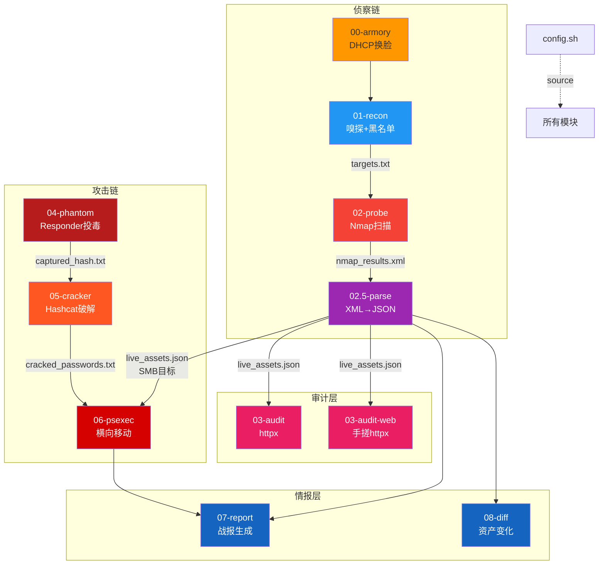

# CatTeam 架构设计文档 V8.0-alpha / A2.0

## 1. 设计哲学

1. **模块化编排** — 每个脚本独立可用，Makefile 统一编排
2. **混合执行** — Mac 宿主机 (嗅探/解析/GPU) + Docker 容器 (Nmap/Impacket)
3. **单一配置源** — `config.sh` 集中管理所有参数
4. **数据驱动** — 模块间通过文件传递数据，上游输出 = 下游输入
5. **双写持久化** — SQLite (AI 查询) + JSON (人工 jq 秒查) 并行输出
6. **Agentic AI** — Gemini 3 自主智能体, ReAct Loop + HITL 三级分权
7. **三端统一** — CLI (TUI 控制台) + API (FastAPI REST) + GUI (React Web Dashboard)

---

## 2. 分层架构

```
┌──────────────────────────────────────────┐
│    🖥️ Web Dashboard (React + Vite)        │ ← V8.0 NEW
│  Bloomberg Terminal UI · 彭博终端级交互    │
│  HUD/Activity Bar/AI Copilot/拓扑图       │
├──────────────────────────────────────────┤
│    🌐 API 层 (FastAPI)                    │ ← V8.0 NEW
│  /api/v1/stats · assets · scans · audit  │
│  CORS · SQLite 查询 · Agent Chat 代理     │
├──────────────────────────────────────────┤
│         控制面 (Makefile v5.0 + TUI)      │
│   preflight → run/fast/phantom/crack/... │
├──────────────────────────────────────────┤
│      🧠 Agent 层 (Gemini 3 Interactions)  │
│  claw-agent: ReAct Loop + HITL 三级分权   │
│  5 工具: query_db/read_file/list_assets   │
│         /execute_shell/run_module        │
├──────────────────────────────────────────┤
│         AI 辅助层 (Gemini Flash)            │
│  16-ai-analyze / 17-ask-lynx / 脱敏层    │
├──────────────────────────────────────────┤
│         合规层 (scope.txt ROE)             │
│  白名单 CIDR 校验 + 黑名单过滤              │
├──────────────────────────────────────────┤
│         模块层 (00-17)                    │
│  侦察链: 00→01(passive|active)→02→02.5   │
│  审计层: 03-audit / 03-web / Nuclei      │
│  攻击链: 04→05→06                        │
│  情报层: 07-report / 08-diff             │
│  后渗透: 09-loot / 10-kerberoast         │
├──────────────────────────────────────────┤
│         数据层 (双写架构)                  │
│  SQLite: claw.db (AI Text-to-SQL)        │
│  JSON:   live_assets.json (jq 兼容)      │
│  隔离:   CatTeam_Loot/{RUN_ID}/          │
├──────────────────────────────────────────┤
│         基础设施层                         │
│  Mac 宿主机 ←── Volume ──→ Docker Kali   │
├──────────────────────────────────────────┤
│         质量层 (make test)                 │
│  Docker Compose 自动化靶场验证             │
└──────────────────────────────────────────┘
```

---

## 3. 全模块职责矩阵

### 侦察链 (Recon Chain)

| 模块 | 环境 | 输入 | 输出 | 关键特性 |
|---|---|---|---|---|
| `00-armory` | Mac | en0 | 新 IP | DHCP 超时保护 (10s) |
| `01-recon` | Mac (sudo) | 网络流量 | `targets.txt` | 正则提取, 黑名单过滤, trap 清理 |
| `02-probe` | Docker | `targets.txt` | `nmap_results.*` | PROFILE 端口切换, 日志保留 |
| `02.5-parse` | Mac (Python) | `nmap_results.xml` | `live_assets.json` + `claw.db` | 双写: SQLite + JSON |

### 审计层 (Audit Layer)

| 模块 | 环境 | 输入 | 输出 | 关键特性 |
|---|---|---|---|---|
| `03-audit` | Docker | `live_assets.json` | `httpx_results.txt` | httpx 应用层指纹 |
| `03-audit-web` | Mac (Python) | `live_assets.json` | `web_fingerprints.txt` | 纯 Python, 10 线程并发 |
| `03-exploit-76` | Mac (Python) | 硬编码 IP | 终端输出 | VNC Banner + SMB 匿名探测 |

### 攻击链 (Attack Chain)

| 模块 | 环境 | 输入 | 输出 | 关键特性 |
|---|---|---|---|---|
| `04-phantom` | **Mac 原生** | en0 网卡 | `captured_hash.txt` | 原生 Responder, 实时 Hash 清洗管线 |
| `05-cracker` | **Mac 原生** | `captured_hash.txt` | `cracked_passwords.txt` | 宿主机 Hashcat (GPU/Metal) |
| `06-psexec` | Docker | `live_assets.json` + 凭据 | `lateral_results.txt` | Impacket smbexec, 凭据自动加载 |

### 情报层 (Intelligence Layer)

| 模块 | 环境 | 输入 | 输出 | 关键特性 |
|---|---|---|---|---|
| `07-report` | Mac (Python) | 所有 Loot 文件 | `CatTeam_Report.md` | 端口热力榜, 凭据脱敏, 风险评级 |
| `08-diff` | Mac (Python) | `claw.db` (fallback JSON) | `asset_diff.json` | SQL EXCEPT 差异引擎 |

### AI 副官 (v5.0 新增)

| 模块 | 环境 | 输入 | 输出 | 关键特性 |
|---|---|---|---|---|
| `db_engine` | Mac (Python) | — | `claw.db` | 四张表 (带有 `env` 字段支持多靶场隔离) |
| `16-ai-analyze` | Mac (Python) | `claw.db` + `web_fingerprints.txt` (最高频同步) | 终端输出 | Gemini Flash 战术分析, 解决时序差异 |
| `17-ask-lynx` | Mac (Python) | `claw.db` + `web_fingerprints.txt` | 终端对话 | 多轮对话, 滑动窗口 10 轮 |

### 工具箱 (v5.0.1 新增)

| 模块 | 环境 | 输入 | 输出 | 关键特性 |
|---|---|---|---|---|
| `11-webhook` | Mac (Python) | `08-diff` 结果 | `alerts/` 目录 | 自动 Diff + AI 分析 + macOS 通知 |
| `scripts/firmware-autopsy` | Mac (Python) | `.bin` 固件文件 | 终端输出 | 零依赖 binwalk 替代, CVE 签名猎杀 |
| `scripts/examples/20-*` | Mac (Python) | IP | 终端输出 | TP-Link CVE PoC (实战参考) |
| `scripts/examples/22-*` | Mac (Python) | IP | 终端输出 | HP 多协议探测 (实战参考) |

### 战术升级 (v5.0.1-B 新增)

| 模块 | 环境 | 输入 | 输出 | 关键特性 |
|---|---|---|---|---|
| `18-ai-bloodhound` | Mac (Python) | BloodHound JSON/ZIP | 终端输出 | Gemini 图论推理 AD 域提权路径 |
| `23-hp-proxy-unlocker` | Mac (Python) | IP + 凭据字典 | 终端输出 | 4 阶段代理解锁: 端口→状态→爆破→隧道 |
| `make toolbox` | Docker/Mac | 交互选择 | 各工具输出 | Nikto/Hydra/Sqlmap/binwalk/固件解剖刀 |

### 🧠 Agent 智能体 (V7.0 新增)

| 模块 | 环境 | 输入 | 输出 | 关键特性 |
|---|---|---|---|---|
| `claw-agent` | Mac (Python) | 自然语言 | 智能分析 + 命令执行 | Gemini 3 Interactions API, ReAct Loop |
| 工具: `claw_query_db` | 内嵌 | SQL | JSON | 只允许 SELECT, 自动放行 |
| 工具: `claw_read_file` | 内嵌 | 文件路径 | 文件内容 | 路径穿越防护, 自动放行 |
| 工具: `claw_list_assets` | 内嵌 | 环境名 | 资产清单 | 自动放行 |
| 工具: `claw_execute_shell` | 内嵌 | shell 命令 | 执行结果 | HITL 三级分权 |
| 工具: `claw_run_module` | 内嵌 | make 命令 | 执行结果 | HITL 三级分权 |

---

## 4. 模块递进关系与数据流



### 数据文件依赖链

```
模块输出                    →  下游消费者
─────────────────────────────────────────
targets.txt                →  02-probe
nmap_results.xml           →  02.5-parse
claw.db                    →  08-diff, 16-ai-analyze, 17-ask-lynx (按 env 过滤)
live_assets.json           →  03-audit, 03-web, 06-psexec, 07-report
web_fingerprints.txt       →  16-ai-analyze, 17-ask-lynx (从 latest 目录直读)
captured_hash.txt          →  05-cracker
cracked_passwords.txt      →  06-psexec (自动加载), 07-report
lateral_results.txt        →  07-report
asset_diff.json            →  07-report (可选)
```

> **三条链 + 一个汇聚点**：侦察链 (00→02.5) 负责发现；攻击链 (04→06) 负责突破；情报层 (07/08) 汇总所有产出生成可交付物。

---

## 5. 混合执行模型

### 为什么不全用 Docker？

| 场景 | Mac 宿主机 | Docker 容器 | 原因 |
|---|---|---|---|
| L2 嗅探 (tcpdump) | ✅ | ❌ | 容器听不到物理网卡广播 |
| Responder 投毒 | ✅ | ❌ | 同上，macOS Docker `--network host` 不生效 |
| Hashcat 破解 | ✅ | ❌ | Docker 无法穿透 Apple Silicon GPU |
| Nmap 扫描 | ❌ | ✅ | 应用层 TCP 可穿透 NAT |
| Impacket 横移 | ❌ | ✅ | 应用层 SMB, 且依赖隔离 |
| 数据解析 (Python) | ✅ | ❌ | 轻量操作无需容器开销 |

---

## 6. 任务隔离机制

```
CatTeam_Loot/
├── 20260325_010000/        ← make run 第一次
│   ├── catteam.log          ← 统一日志
│   ├── targets.txt
│   ├── nmap_results.*
│   ├── live_assets.json
│   ├── captured_hash.txt    ← 04 输出
│   ├── cracked_passwords.txt ← 05 输出
│   ├── lateral_results.txt  ← 06 输出
│   ├── CatTeam_Report.md    ← 07 输出
│   ├── asset_diff.json      ← 08 输出
│   ├── responder.pid        ← 04 进程管理
│   └── extractor.pid
├── 20260325_020000/        ← make run 第二次
└── latest → 20260325_020000
```

- 侦察链 (`make run/fast`) 创建新 `RUN_ID` 目录
- 攻击链 (`make phantom/crack/lateral`) 使用 `USE_LATEST=true` 附加到最新目录

---

## 7. 错误处理策略

| 场景 | 策略 |
|---|---|
| DHCP 卡死 | 后台执行 + 超时强制终止 |
| tcpdump Ctrl+C | `trap INT TERM` 清理 |
| Docker 未启动 | Makefile `preflight` 拦截 |
| Responder 重复启动 | PID 检测 + 拒绝重复点火 |
| Hash 格式截断 | `sed` 全行提取，不用 awk 切割 |
| Hashcat 找不到字典 | 自动搜索 3 个常见路径 |
| 凭据硬编码 | 环境变量 > 05自动加载 > 交互输入 (绝不走 CLI) |
| 密码暴露在 history | OPSEC: 禁止命令行参数传递密码 |
| `jq` 在 Mac 不存在 | 用 Python 替代 JSON 解析 |
| 多次运行覆盖数据 | 时间戳目录隔离 |
